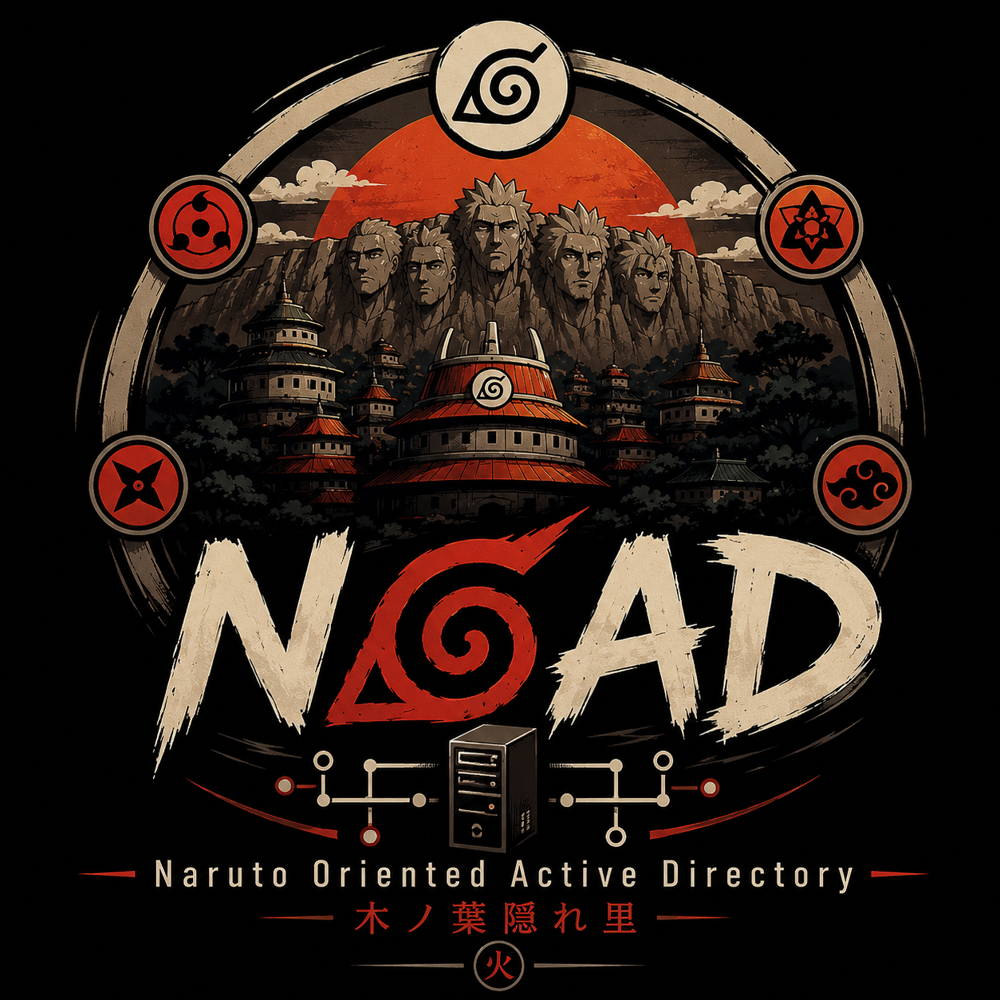

<div align="center">
  

  <h1>NOAD</h1>
  <p><strong>Naruto Oriented Active Directory</strong></p>

  <p>
    
    
    
    
  </p>
</div>

Deliberately vulnerable Active Directory lab, Naruto-themed, deployed with
Vagrant + VirtualBox + Ansible. See [`docs/NOAD.md`](docs/NOAD.md) for the
full infrastructure and credentials,
[`docs/architecture.md`](docs/architecture.md) for the thematic mapping,
and [`docs/attack-path.md`](docs/attack-path.md) for the complete attack
chain.

## Prerequisites on the deployment host (192.168.1.21)

- VirtualBox and Vagrant installed.
- Ansible collections `ansible.windows` and `microsoft.ad` installed
  (`ansible-galaxy install -r ansible/requirements.yml`).
- Python 3 with PyYAML (`pip install pyyaml`) for `noadctl`.
- This repo copied to `~/naruto-lab`.

## Deployment

### The easy way: `noadctl`

A small dependency-free CLI (like GOAD's `go.py` or PantheonLab's helper
scripts) wraps Vagrant + Ansible into single commands:

```bash
cd ~/naruto-lab
./noadctl deploy          # vagrant up + wait for WinRM + full ansible provisioning
./noadctl status          # vagrant status + WinRM reachability per host
./noadctl creds           # print every account/password in the lab
./noadctl attack-path     # print docs/attack-path.md
./noadctl snapshot save clean-install   # checkpoint before you start attacking
./noadctl snapshot restore clean-install
./noadctl destroy         # tear everything down (asks for confirmation)
```

Run `./noadctl --help` for the full command list (`up`, `halt`, `wait`,
`provision`, `vpn-status`, ...).

### The manual way

```bash
cd ~/naruto-lab
vagrant up
```

Downloads the `gusztavvargadr/windows-server-2022-standard` and
`gusztavvargadr/windows-10` boxes (first run only), then creates and
starts `hokage-dc01` (192.168.56.10), `anbu-srv01` (192.168.56.11),
`mission-srv01` (192.168.56.12) and `academy-ws01` (192.168.56.13) on a
VirtualBox private network. Vagrant itself does not trigger any
provisioning: `ansible/site.yml` handles that separately.

```bash
cd ~/naruto-lab/ansible
ansible-playbook site.yml -i inventory/hosts.yml
```

Play order: DC promotion -> OU/group/user creation -> domain join for
member servers/workstations -> applying the deliberate vulnerabilities
(see [`docs/architecture.md`](docs/architecture.md) for details).

### Attack

From `academy-ws01`, or remotely over the WireGuard tunnel (see
`docs/NOAD.md`, Remote access section) from a separate attack machine
(e.g. Kali): see [`docs/attack-path.md`](docs/attack-path.md).

## Notes / known limitations

- **RAM**: ~10 GB needed for the 4 VMs running simultaneously (15 GB
  total host RAM). A Suna extension (2nd domain) will require shutting
  down VMs between phases, or more RAM.
- SQL Server, ADCS and Windows LAPS are **not** actually installed in this
  version - see `docs/NOAD.md` (Scope section) for details.
- The passwords in this repo (`ansible/group_vars/all/domain.yml`,
  `ansible/group_vars/all/naruto_universe.yml`) are deliberately stored in
  plaintext for a local lab - never reproduce this outside an isolated
  environment.
